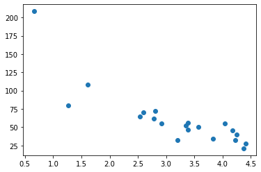

```python
#importing library & moduls
import matplotlib.pyplot as plt
import numpy 
numpy.random.seed(2)

x = numpy.random.normal(3,1,100)
y = numpy.random.normal(150,40,100) / x

plt.scatter(x,y)
plt.show()
```


    

    


```python
#split into test and train
train_x = x[:80]
train_y = y[:80]

test_x = x[80:]
test_y = y[80:]


```


```python
#Display the Training set
plt.scatter(train_x, train_y)
plt.show()
```


    

    


```python
#Display the Testing Set
plt.scatter(test_x, test_y)
plt.show()
```


    

    


```python
#polynomial regression, which is a type of supervised learning in machine learning
import numpy 
import matplotlib.pyplot as plt
numpy.random.seed(2)

x = numpy.random.normal(3,1,100)
y = numpy.random.normal(150,40,100) / x

train_x = x[:80]
train_y = y[:80]

test_x = x[80:]
test_y = y[80:]

mymodel = numpy.poly1d(numpy.polyfit(train_x, train_y, 4))
                              
myline = numpy.linspace(0, 6, 100)                              

plt.scatter(train_x, train_y)
plt.plot(myline, mymodel(myline))                              
plt.show()
```


    

    


```python

```
